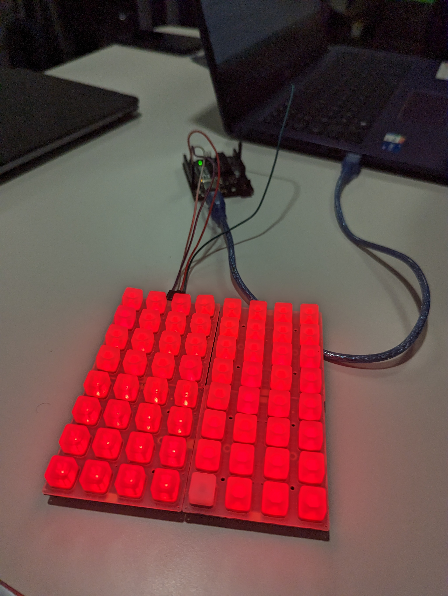

## Project

Create a memory game with an arduino card and NeoTrellis. the goal will be to remember the sequence generated and
reproduct it, each time you suceed we strengthen the level.

## Installation

download Adafruit NeoTrellis library

## Contributing

Pull requests are welcome ;).

## Contributor

[Tyranosaurus's portfolio](tyrano-folio.vercel.app)

[julienBelinga's portfolio](julien-belinga.fr)
