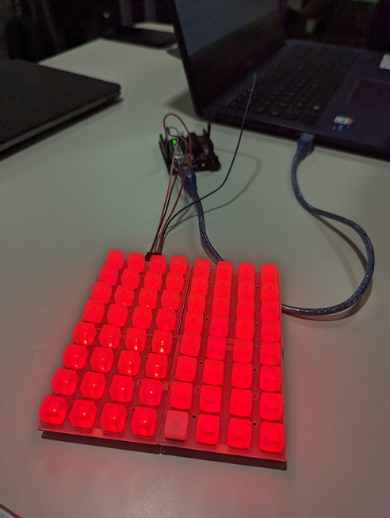

## Project

Create a memory game with an arduino card and NeoTrellis. the goal will be to remember the sequence generated and
reproduct it, each time you suceed we strengthen the level.

## Installation

download Adafruit NeoTrellis library

## Contributing

Pull requests are welcome ;).

## License

tyrano-folio.vercel.app
julien-belinga.fr
